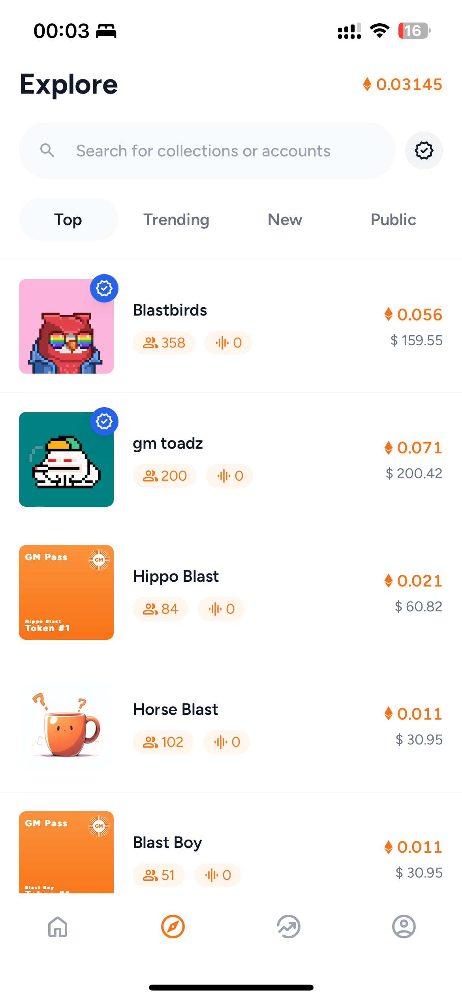
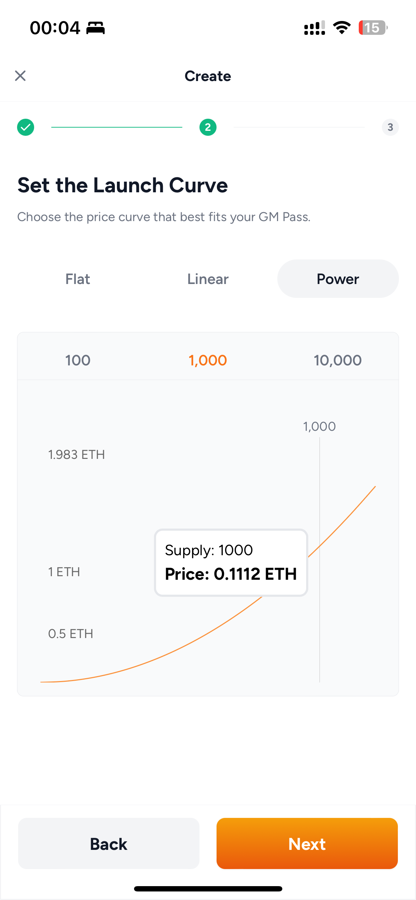
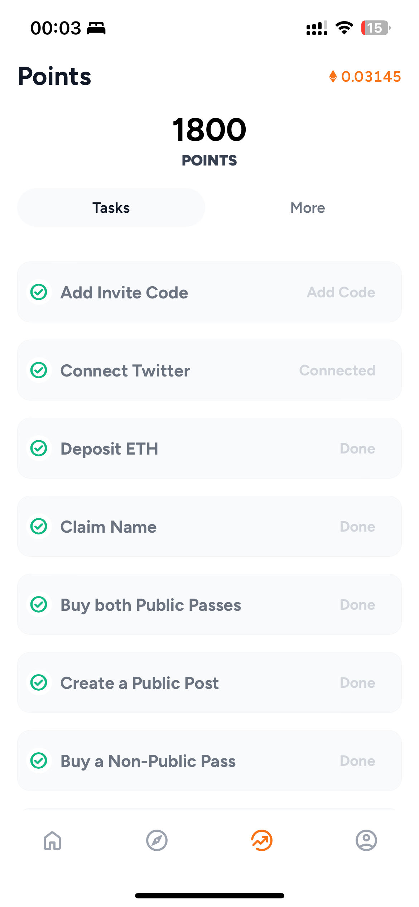
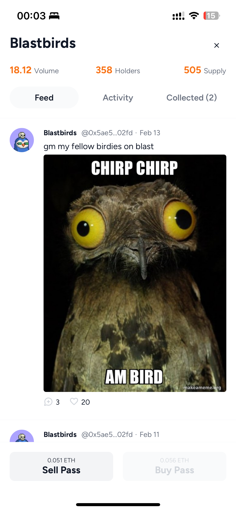

  
  
Connect, Create, Collect

 

> 🚀 **gm.app is live on Blast**

Check out [gm.app](https://gm.app). 

- buy and create NFT-collections on bonding curves
- find the coolest communities in the public feeds
- participate into the social features, become a 💠👐-trader and collect gm.points
- hang out with fellow holders in the private feeds

In this README you find 
1. [General Overview](#general-overview)
2. [Upcoming](#upcoming)
3. [Developer Resources](#blast-points-operator)
 

# General Overview 

## What is GM?
GM is a platform that allows users to connect with like-minded individuals in the crypto community, share content, and participate in discussions. In addition to a public feed, GM also offers a private feed based on posts from specific collections to which the user has access.

## How Does GM Work?

**Public Feed**: The public feed displays a variety of posts from the entire GM community. Here, users can discover, discuss, and share content.

**Private Feed**: The private feed displays posts from collections to which the user has access. A pass is an NFT (Non-Fungible Token) that can be purchased from a bonding curve and grants access to specific collections. These collections can be created by users to share content with selected communities.

**Collection Passes**: Passes are acquired through a bonding curve and can also be sold back on this curve. Depending on the configuration of the collection, the price of the pass can be constant or increase either linearly or exponentially, so that early entry can be advantageous.

**GM NameService**: The GM NameService allows usernames to be traded on a constant bonding curve. This enables users to secure their unique identities.

## Why Use GM?

**Community Engagement**: Join communities that align with your interests and share content with like-minded individuals.

**Fees**: When Collection Passes are bought or sold for the collection you have created on the Bonding Curve, you can receive fees charged on purchases and sales. This allows you to benefit from their good and interesting content.

**Creative Freedom**: Create your own collections and share content with your own community or follow other communities, projects, or influencers to discover inspiring content.

 

Join the GM community to secure your usernames early and get involved in the bonding curve of collections early. Experience the future of the social network for the crypto community with GM!

 

  
  
  
  
  

## Goals
- Solve the incentive problem between holders and creators of NFT and create a sustainable way to enable creator earnings
- Strengthen the fascinating overlap of SocialFi and NFT communities
- Enable snappy mobile trading & socialFi experiences through instant-liquidity bonding curves for NFTs

# Upcoming

### Technical & UX
- push notifications
- integration of [DN-404](https://github.com/Vectorized/dn404) (ERC-404)
- improved bootstraping of token-gated communities
- reworked feeds (from public and private to community-feeds)
- chats 

### Creators
- creator onboarding program

## Blast Points Operator

0xEd703E95b3Bd969BED1C11fcbE85dE35178ce30D

## Contracts

- **NameService for usernames with 8-20 characters**:   0x957F80A088EDf41DEa492341FF1DdAD58722a516

## Tech Stack
- solidity
- react pwa
- privy
- indexing via self hosted [graph](https://github.com/graphprotocol)
- aws lambda functions 

