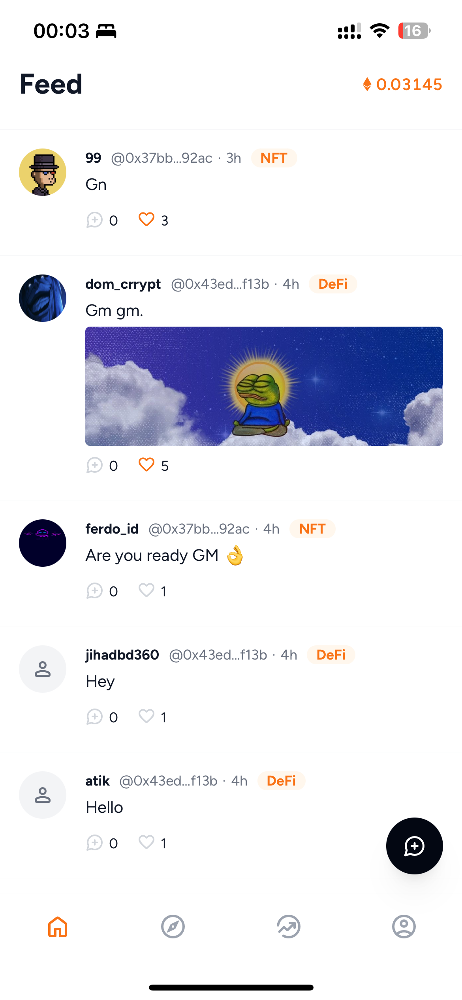

  
  
Connect, Create, Collect

 

> 🚀 **gm.app is live on Blast**

Check out [gm.app](https://gm.app). 

- buy and create NFT-collections on bonding curves
- find the coolest communities in the public feeds
- participate into the social features, become a 💠👐-trader and collect gm.points
- hang out with fellow holders in the private feeds

 

  
  
  
  
  

## Goals
- Solve the incentive problem between holders and creators of NFT and create a sustainable way to enable creator earnings
- Strengthen the fascinating overlap of SocialFi and NFT communities
- Enable snappy mobile trading & socialFi experiences through instant-liquidity bonding curves for NFTs

## Upcoming

### Technical & UX
- push notifications
- integration of [DN-404](https://github.com/Vectorized/dn404) (ERC-404)
- improved bootstraping of token-gated communities
- reworked feeds (from public and private to community-feeds)
- chats 

### Creators
- creator onboarding program

## Blast Points Operator

0xEd703E95b3Bd969BED1C11fcbE85dE35178ce30D

## Contracts

- **NameService for usernames with 8-20 characters**:   0x957F80A088EDf41DEa492341FF1DdAD58722a516

## Tech Stack
- solidity
- react pwa
- privy
- indexing via self hosted [graph](https://github.com/graphprotocol)
- aws lambda functions 

